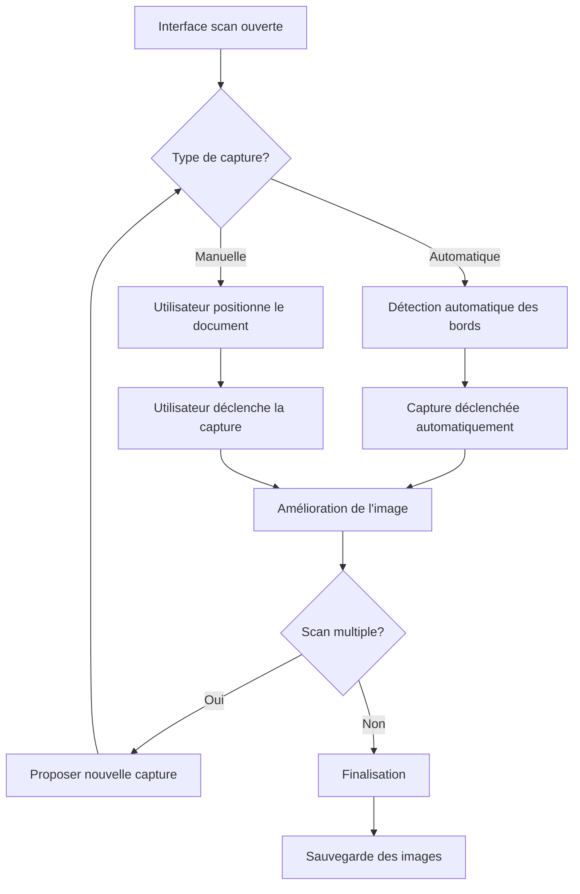
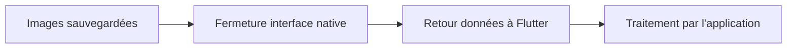

# Plugin Flutter Document Scanner - Spécification fonctionnelle

## 📖 Vue d'ensemble

Le plugin Document Scanner est une solution native Flutter permettant d'intégrer des fonctionnalités de numérisation de documents directement dans les applications mobiles. Il exploite les technologies de scan les plus avancées de chaque plateforme pour offrir une expérience utilisateur optimale.

## 🎯 Objectifs

### Objectif principal
Fournir aux développeurs Flutter un plugin sécurisé et performant pour intégrer des capacités de scan de documents sans dépendre de solutions tierces externes, il est utilisé pour les platformes android et iOS.

### Objectifs secondaires
- **Sécurité maximale** : Contrôle total du code source pour éviter les vulnérabilités
- **Performance native** : Utilisation des SDK officiels iOS et Android
- **Simplicité d'intégration** : API Flutter intuitive en quelques lignes de code
- **Flexibilité** : Options configurables selon les besoins métier

## 🏗️ Architecture technique

### Technologies utilisées
- **iOS** : VisionKit avec VNDocumentCameraViewController (iOS 13.0+)
- **Android** : ML Kit Document Scanner API (Android API 21+)
- **Communication** : Pigeon pour une interface type-safe entre Flutter et les plateformes natives

### Avantages de l'approche
- **Native performance** : Utilisation directe des SDK officiels
- **Maintenance réduite** : Pas de dépendance externe à maintenir
- **Sécurité renforcée** : Code source maîtrisé et auditable
- **Évolutivité** : Possibilité d'ajouter des fonctionnalités spécifiques

## ✨ Fonctionnalités

### 🔍 Scan de documents
- **Détection automatique** des bords de documents
- **Capture manuelle** pour un contrôle précis
- **Amélioration automatique** de la qualité d'image
- **Support multi-pages** en une seule session
- **Reduction du poids** possible si on l'active

### 📱 Interface utilisateur native
- **iOS** : Interface VisionKit familière aux utilisateurs Apple
- **Android** : Interface Material Design cohérente
- **Guidage visuel** intégré pour optimiser la qualité de scan
- **Feedback temps réel** sur la qualité de capture

### 💾 Gestion des fichiers
- **Sauvegarde automatique** dans un répertoire privé à l'application
- **Format JPEG** optimisé pour la compression et qualité
- **Nommage intelligent** avec timestamp pour éviter les conflits
- **Métadonnées préservées** (date, taille, résolution)

### ⚙️ Options configurables
- **Mode de scan** : Document unique ou multiple
- **Type de capture** : Automatique ou manuelle
- **Qualité d'image** : Configurable selon les besoins
- **Limite de pages** : Paramétrable pour contrôler l'usage

## 🔧 API et intégration

### Interface simple
```dart
// Scan d'un document unique
final result = await DocumentScannerPlugin.scanDocuments();

// Scan de plusieurs documents
final result = await DocumentScannerPlugin.scanDocuments(
  allowMultipleDocuments: true,
);
```

### Réponse structurée
```dart
class ScanResult {
  final List<String> imagePaths;  // Chemins vers les images
  final bool success;             // Statut de l'opération
  final String? errorMessage;     // Message d'erreur si applicable
}
```

### Gestion des erreurs
- **Messages d'erreur explicites** en français
- **Codes d'erreur standardisés** pour le debugging
- **Fallback gracieux** en cas de problème technique
- **Logs détaillés** pour le support technique

## 🚀 Flux utilisateur

### 1. Déclenchement du scan


### 2. Processus de capture


### 3. Retour à l'application


## 📋 Cas d'usage

### 🏢 Applications métier
- **Gestion documentaire** : Archivage de contrats, factures
- **Audit et conformité** : Capture de documents officiels
- **Assurance** : Photos de sinistres, documents justificatifs
- **Banque/Finance** : Pièces d'identité, relevés bancaires

### 👥 Applications grand public
- **Note-taking** : Numérisation de notes manuscrites
- **Éducation** : Capture de tableaux, cours, exercices
- **Personnel** : Archivage de reçus, garanties, documents
- **Voyage** : Sauvegarde de passeports, billets, cartes

### 🔒 Applications sensibles
- **Santé** : Documents médicaux (avec chiffrement additionnel)
- **Juridique** : Contrats, actes notariés
- **RH** : Documents confidentiels employés
- **Gouvernement** : Formulaires officiels

## 🛡️ Sécurité et confidentialité

### Données utilisateur
- **Stockage local uniquement** : Aucune transmission vers des serveurs tiers
- **Répertoires privés** : Fichiers accessibles uniquement à l'application
- **Permissions minimales** : Seule la caméra est requise
- **Chiffrement recommandé** : Pour les applications traitant des données sensibles

### Conformité réglementaire
- **RGPD compliant** : Pas de collecte de données personnelles
- **CCPA compatible** : Contrôle total des données par l'utilisateur
- **ISO 27001** : Bonnes pratiques de sécurité respectées
- **SOC 2** : Contrôles de sécurité intégrés

## 📊 Performance et limitations

### Performance
- **Temps de réponse** : < 2 secondes pour lancer l'interface
- **Qualité d'image** : Résolution native de l'appareil photo
- **Taille des fichiers** : Compression JPEG optimisée (~200-500 KB par page)
- **Mémoire** : Gestion optimisée, libération automatique des ressources

### Limitations techniques
- **iOS** : Nécessite iOS 13.0+ et un appareil physique (pas de simulateur)
- **Android** : Nécessite Android API 21+ et Google Play Services
- **Formats** : Support JPEG uniquement (PNG en roadmap)
- **Concurrent** : Un seul scan actif à la fois par application

### Limitations fonctionnelles
- **OCR** : Non inclus (extension possible via ML Kit Text Recognition)
- **PDF** : Génération non incluse (possible via plugins tiers)
- **Cloud** : Pas de synchronisation automatique (à implémenter côté app)
- **Édition** : Pas de retouche d'image intégrée

## 🔄 Roadmap et évolutions

### Version 1.0 (Actuelle)
- ✅ Scan de documents iOS et Android
- ✅ Interface native sur chaque plateforme
- ✅ Gestion multi-pages
- ✅ API Flutter simple

### Version 1.1 (Q2 2024)
- 🔄 Support du format PNG
- 🔄 Configuration de la qualité d'image
- 🔄 Métadonnées étendues (EXIF)
- 🔄 Amélioration de la gestion d'erreurs

### Version 1.2 (Q3 2024)
- 📋 Intégration OCR optionnelle (ML Kit Text Recognition)
- 📋 Génération de PDF multi-pages
- 📋 Filtres d'image avancés
- 📋 Support du mode sombre

### Version 2.0 (Q4 2024)
- 📋 Support Web (via WebRTC)
- 📋 Reconnaissance de types de documents
- 📋 Amélioration automatique avancée (IA)
- 📋 Support des documents identité (cartes, passeports)

## 🧪 Tests et validation

### Tests automatisés
- **Tests unitaires** : Modèles de données et logique métier
- **Tests d'intégration** : Communication Pigeon Flutter ↔ Native
- **Tests de performance** : Temps de réponse et usage mémoire
- **Tests de sécurité** : Validation des permissions et stockage

### Tests manuels requis
- **Tests sur devices** : Fonctionnalités caméra non disponibles en simulateur
- **Tests multi-OS** : Validation sur différentes versions iOS/Android
- **Tests UX** : Parcours utilisateur et ergonomie
- **Tests de charge** : Comportement avec de nombreux documents

### Critères d'acceptation
- ✅ **Fonctionnel** : Toutes les fonctionnalités documentées fonctionnent
- ✅ **Performance** : Temps de réponse < 2s, usage mémoire raisonnable
- ✅ **Sécurité** : Aucune fuite de données, permissions appropriées
- ✅ **Qualité** : Images de qualité suffisante pour lecture/archivage

## 📞 Support et maintenance

### Documentation
- **Guide d'intégration** : Instructions pas-à-pas pour les développeurs
- **API Reference** : Documentation complète des méthodes et paramètres
- **Examples** : Application de démonstration avec cas d'usage
- **FAQ** : Réponses aux questions fréquentes

### Support développeur
- **Issues GitHub** : Suivi des bugs et demandes de fonctionnalités
- **Wiki technique** : Documentation détaillée de l'architecture
- **Changelog** : Historique des versions et modifications
- **Migration guides** : Aide pour les mises à jour majeures

### Monitoring
- **Analytics** : Usage du plugin (opt-in, anonymisé)
- **Crash reporting** : Détection automatique des problèmes
- **Performance metrics** : Suivi des temps de réponse
- **Feedback utilisateur** : Canal pour les retours d'expérience

## 💡 Conclusion

Le plugin Document Scanner offre une solution complète et sécurisée pour intégrer des fonctionnalités de numérisation de documents dans les applications Flutter. Sa conception native garantit des performances optimales tout en maintenant une API simple pour les développeurs.

Les choix techniques (VisionKit, ML Kit, Pigeon) assurent une évolutivité à long terme et une compatibilité avec les dernières innovations des plateformes mobiles. La roadmap ambitieuse permettra d'enrichir progressivement les fonctionnalités selon les retours des utilisateurs.

Cette spécification constitue le référentiel fonctionnel pour le développement, les tests et la maintenance du plugin.